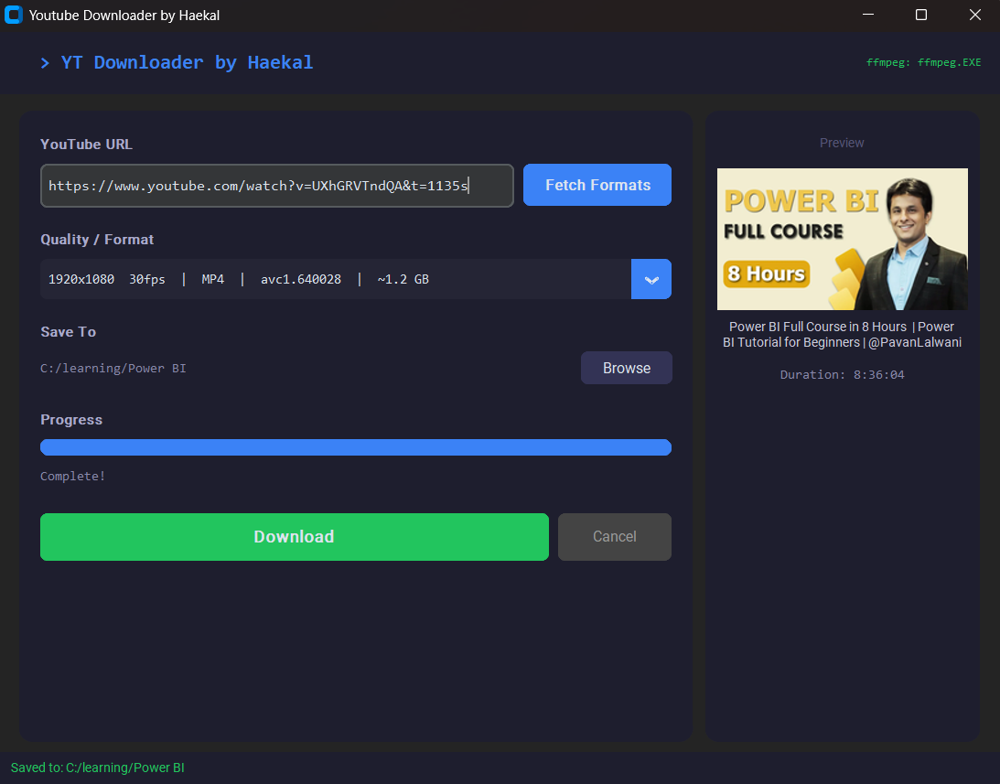

<div align="center">

# 🎬 YT-DLP Downloader

**A clean, modern GUI wrapper for yt-dlp — download YouTube videos in any quality, merged to MP4, with zero command-line knowledge required.**


</div>

---

## ✨ Features

- 🔍 **Format Inspector** — fetches all available video qualities before downloading
- 🎯 **Quality Selector** — choose exact resolution + FPS from a dropdown (e.g. `1080p60`, `720p`, `4K`)
- 🔀 **Auto Merge** — downloads video and audio as separate streams, merges to a single `.mp4` via FFmpeg
- 🔊 **AAC Audio** — re-encodes audio to AAC 192k for universal MP4 compatibility
- 📊 **Live Progress Bar** — real-time download percentage, speed, and ETA
- 🖼️ **Thumbnail Preview** — displays video thumbnail and duration after fetching formats
- 📁 **Custom Save Folder** — browse and select any output directory
- ⚡ **Non-blocking UI** — all network operations run in background threads
- 🌑 **Dark Mode** — modern dark UI built with CustomTkinter
- 🛡️ **FFmpeg Auto-Detection** — finds `ffmpeg.exe` in PATH or common install directories automatically
- ⌨️ **Keyboard Shortcut** — press `Enter` in the URL field to fetch formats instantly

---

## 📸 Screenshots

```
┌─────────────────────────────────────────────────────────────────────┐
│  ▶  YT-DLP Downloader                              ffmpeg: found    │
├─────────────────────────────────────────┬───────────────────────────┤
│                                         │  Preview                  │
│  YouTube URL                            │  ┌─────────────────────┐  │
│  ┌───────────────────────────┐ [Fetch]  │  │   [thumbnail img]   │  │
│  │ https://youtube.com/...   │          │  └─────────────────────┘  │
│  └───────────────────────────┘          │                           │
│                                         │  Video Title Here         │
│  Quality / Format                       │                           │
│  ┌──────────────────────────────────┐   │  Duration: 10:32          │
│  │ 1920x1080  60fps | WEBM | ~180MB │   │                           │
│  └──────────────────────────────────┘   │                           │
│                                         │                           │
│  Save To                                │                           │
│  C:\Users\...\Downloads        [Browse] │                           │
│                                         │                           │
│  Progress                               │                           │
│  ████████████████░░░░  72%              │                           │
│  Downloading 72%  4.2 MB/s  ETA 8s      │                           │
│                                         │                           │
│  [    ⬇  Download    ]    [ Cancel ]    │                           │
├─────────────────────────────────────────┴───────────────────────────┤
│  ✓ Saved to: C:\Users\...\Downloads                                 │
└─────────────────────────────────────────────────────────────────────┘
```

---

## 🚀 Getting Started

### Prerequisites

| Requirement | Version | Notes |
|-------------|---------|-------|
| Python | 3.9+ | [Download](https://python.org/downloads) — check *Add to PATH* |
| FFmpeg | Any | [Download](https://ffmpeg.org/download.html) — see setup below |

### FFmpeg Setup (Windows)

**Option A — Recommended (place next to script):**
1. Download FFmpeg from [ffmpeg.org](https://ffmpeg.org/download.html) → Windows builds
2. Extract the ZIP and find `ffmpeg.exe` inside the `bin/` folder
3. Copy `ffmpeg.exe` into the same folder as `ytdlp_gui.py`
4. Done — the app detects it automatically

**Option B — Add to system PATH:**
1. Extract FFmpeg to `C:\ffmpeg`
2. Open *Start → Edit the system environment variables → Environment Variables*
3. Under *System Variables*, select `Path` → Edit → New → add `C:\ffmpeg\bin`
4. Click OK and restart the app

### Install Python Dependencies

```bash
pip install customtkinter yt-dlp Pillow requests
```

### Run the App

```bash
python ytdlp_gui.py
```

---

## 🔨 Build as Standalone `.exe`

No Python required on the end user's machine.

### Automatic Build (Recommended)

```
1. Place all files in one folder:
   ytdlp_gui.py
   ytdlp_gui.spec
   build.bat

2. Double-click build.bat
3. Wait 1–3 minutes
4. Your exe appears in dist\
```

### Manual Build

```bash
pip install pyinstaller
pyinstaller ytdlp_gui.spec --noconfirm
```

Output: `dist\YT-DLP Downloader.exe`

### Distributing to Others

Share these two files (in the same folder):

```
📁 YT-DLP Downloader\
├── YT-DLP Downloader.exe    ← your built exe
└── ffmpeg.exe               ← copy from C:\ffmpeg\bin\
```

> **Note:** FFmpeg is not bundled inside the `.exe`. It must be present next to the exe or on the user's PATH.

---

## 📖 How It Works

### Format Selection

YouTube serves video and audio as **separate DASH streams** for resolutions above 360p. The app:

1. Calls `yt_dlp.YoutubeDL.extract_info()` with `skip_download=True` to retrieve all available formats without downloading anything
2. Filters to **video-only streams** (streams with a real `vcodec`) — audio-only streams are excluded
3. Deduplicates by `(height, fps)` to avoid 20 near-identical entries
4. Sorts best quality first and populates the dropdown

### Download & Merge

When you click **Download**, yt-dlp uses a tiered format selector:

```
<video_id>+bestaudio[ext=m4a]       ← preferred: video + AAC audio
<video_id>+bestaudio[ext=webm]      ← fallback: video + Opus audio
<video_id>+bestaudio                ← fallback: video + any audio
best[height<=N][ext=mp4]            ← fallback: pre-muxed MP4
best[height<=N]                     ← last resort: any muxed stream
```

FFmpeg then merges both streams with:
- **Video:** stream-copied (no re-encoding, no quality loss, fast)
- **Audio:** re-encoded to **AAC 192k** (ensures compatibility with all MP4 players)

---

## ⚙️ Configuration

All settings are managed through the UI. No config files needed.

| Setting | Description | Default |
|---------|-------------|---------|
| URL | YouTube (or other supported site) URL | — |
| Quality | Video resolution + FPS selected from dropdown | Best available |
| Save To | Output directory | `~/Downloads` |

---

## 🐛 Troubleshooting

<details>
<summary><strong>FFmpeg not detected</strong></summary>

The app searches for `ffmpeg.exe` in this order:
1. System PATH
2. Same folder as `ytdlp_gui.py` / `YT-DLP Downloader.exe`
3. `C:\ffmpeg\bin\`
4. `C:\Program Files\ffmpeg\bin\`
5. `C:\Program Files (x86)\ffmpeg\bin\`
6. `~/ffmpeg/bin/`

**Quickest fix:** copy `ffmpeg.exe` next to the script/exe.
</details>

<details>
<summary><strong>Video downloads but no audio</strong></summary>

This happens when FFmpeg is not found — yt-dlp downloads the video stream but cannot merge audio without FFmpeg. Ensure FFmpeg is installed and detectable (see above).
</details>

<details>
<summary><strong>3 files appear after download</strong></summary>

The app sets `keep_video: False` which instructs yt-dlp to delete temp `.webm` and `.m4a` streams after a successful merge. If extra files appear, ensure FFmpeg completed the merge successfully (check the status bar — it should say "Saved to: ...").
</details>

<details>
<summary><strong>yt-dlp error / video unavailable</strong></summary>

- Age-restricted videos require cookies — not supported in this version
- Private videos cannot be downloaded
- Update yt-dlp regularly: `pip install -U yt-dlp`
</details>

<details>
<summary><strong>Antivirus flags the .exe</strong></summary>

This is a common false positive with PyInstaller-built executables. Add an exception in your antivirus for the exe, or run from source (`python ytdlp_gui.py`) instead.
</details>

<details>
<summary><strong>exe crashes silently on launch</strong></summary>

Run it from Command Prompt to see the error:

```cmd
cd dist
"YT-DLP Downloader.exe"
```
</details>

---

## 📦 Dependencies

| Package | Purpose | Required |
|---------|---------|----------|
| `customtkinter` | Modern dark-mode GUI framework | ✅ Yes |
| `yt-dlp` | Video info extraction and download | ✅ Yes |
| `Pillow` | Thumbnail image processing | ⚪ Optional |
| `requests` | HTTP client for thumbnail download | ⚪ Optional |
| `ffmpeg` | Video/audio merging (external binary) | ✅ Yes |

---

## 🗂️ Project Structure

```
ytdlp-downloader/
├── ytdlp_gui.py          # Main application (single file)
├── ytdlp_gui.spec        # PyInstaller build configuration
├── build.bat             # One-click Windows build script
├── README.md             # This file
└── dist/
    └── YT-DLP Downloader.exe   # Built executable (after build)
```

---

## 🔄 Changelog

### v2.0.0 — QA/QC Clean Rewrite
- Fixed 15 bugs identified in full code audit
- Fixed `keep_video` option key (was `keepvideo` — invalid)
- Fixed `postprocessor_args` to correctly target `FFmpegMergerPP`
- Fixed lambda closure bugs in all callbacks
- Fixed `outtmpl` to use `%(ext)s` (prevents filename conflicts with temp files)
- Fixed status bar layout order (prevents it being hidden behind content)
- Fixed `Optional[str]` type hint (was `str | None` — Python 3.9 incompatible)
- Removed unused imports (`json`, `subprocess`)
- Added `None` guard for private/unavailable videos
- Added `traceback` for detailed error reporting
- Added `Enter` key binding on URL field
- Added FFmpeg status indicator in header

### v1.0.0 — Initial Release
- Basic GUI with URL input, format selection, download + merge
- Thumbnail preview panel
- Progress bar with speed and ETA
- Custom output folder picker
- FFmpeg auto-detection across common Windows paths

---

## 🤝 Contributing

Pull requests are welcome. For major changes, please open an issue first.

1. Fork the repository
2. Create your feature branch (`git checkout -b feature/AmazingFeature`)
3. Commit your changes (`git commit -m 'Add AmazingFeature'`)
4. Push to the branch (`git push origin feature/AmazingFeature`)
5. Open a Pull Request

---

## ⚖️ Legal

This tool is intended for downloading videos you own the rights to, or that are licensed for download. Downloading copyrighted content without permission may violate YouTube's Terms of Service and applicable copyright law. Use responsibly.

---

## 📄 License

Distributed under the MIT License. See `LICENSE` for more information.

---

<div align="center">

Built with ❤️ using [yt-dlp](https://github.com/yt-dlp/yt-dlp) + [CustomTkinter](https://github.com/TomSchimansky/CustomTkinter) + [FFmpeg](https://ffmpeg.org)

</div>